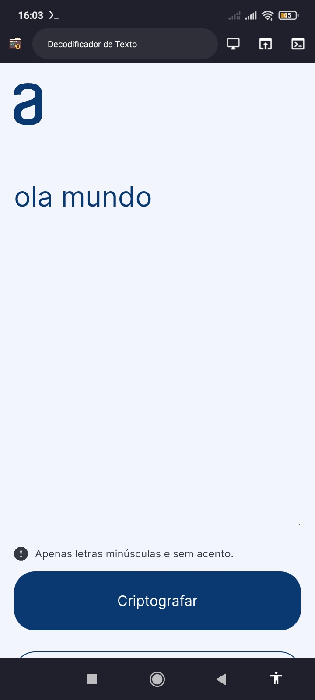
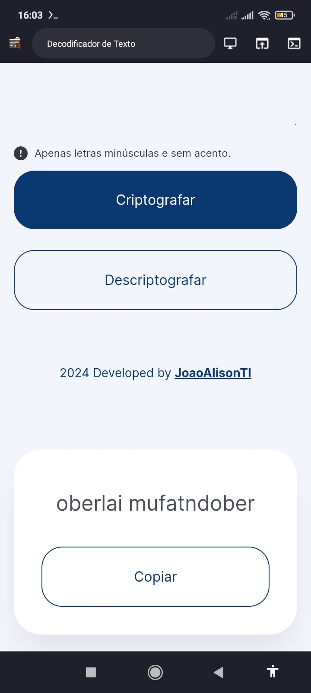
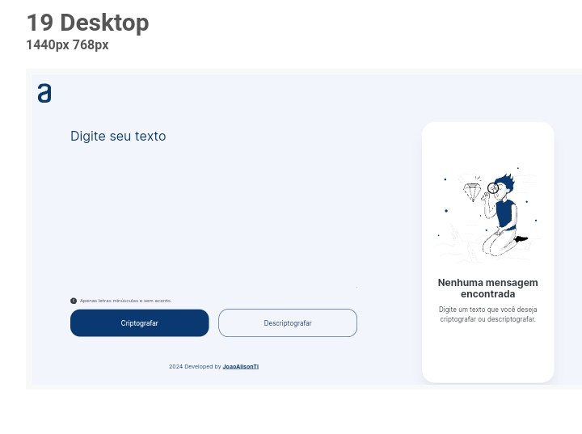

<h2 align="center">Decodificador de Texto 🔍🔤</h2>

Desenvolvido durante Janeiro/Fevereiro de 2024 como desafio proposto pelo ONE (Oracle Next Education) em parceria com a Alura 🚀⚡.  

- [Overview](#overview)
  - [Sobre o projeto](#sobre)
  - [Screenshots](#screenshots)
  - [Links](#links)
- [My process](#my-process)
  - [Desenvolvido com](#tecnologias)
  - [Continuar o desenvolvimento](#continuar-o-desenvolvimento)
  - [Recursos úteis](#recursos-úteis)
- [Author](#autor)

 

## Overview
### Sobre
Se trata de uma aplicação que criptografa e descriptografa textos, assim você poderá trocar mensagens secretas com outras pessoas que saibam o segredo da criptografia utilizada.

As "chaves" de criptografia utilizadas são:
- `A letra "e" é convertida para "enter"`
- `A letra "i" é convertida para "imes"`
- `A letra "a" é convertida para "ai"`
- `A letra "o" é convertida para "ober"`
- `A letra "u" é convertida para "ufat"`

**Requisitos:**
- Deve funcionar apenas com letras minúsculas
- Não devem ser utilizados letras com acentos nem caracteres especiais
- Deve ser possível converter uma palavra para a versão criptografada e também retornar uma palavra criptografada para a versão original. Por exemplo: `"gato" => "gaitober"`;  `"gaitober" => "gato"`

- A página deve ter campos para inserção do texto a ser criptografado ou descriptografado, e a pessoa usuária deve poder escolher entre as duas opções
- O resultado deve ser exibido na tela.

**Extras:**
- Um botão que copie o texto criptografado/descriptografado para a área de transferência - ou seja, que tenha a mesma funcionalidade do `ctrl+C` ou da opção "copiar" do menu dos aplicativos.

### Screenshots

  

  

  

### Links
- [Acesse o projeto finalizado, online ☁️](https://joaoalisonti.github.io/text-decoder/)
- [Figma do projeto](https://www.figma.com/file/tvFEYhVfZTjdJ5P24RGV21/Alura-Challenge---Desafio-1---L%C3%B3gica?node-id=16%3A802)

 

## My process
### Tecnologias
### ⚙️👨‍💻
Esse projeto foi desenvolvido com as seguintes tecnologias:

- **HTML5/CSS3:** Estruturação/Estilização
- **JavaScript:** Funcionalidades do app
- **Figma:** Design
- **Trello:** Gerenciamento de Sprints
- **Git/Github:** Versionamento de código

### Continuar o desenvolvimento
No geral em termos das principais funcionalidades está tudo ok, porém há a necessidade de refatoração do código para deixar mais enxuto, e adicionar mais estilização para acessibilidade de outros dispositivos. Além disso, pretendo adicionar outras Toast Notifcations para quando o usuário criptografar, descriptografar ou copiar ele possa receber um aviso de sucesso para cada ação.

### Recursos úteis
- [How To Create A Toast Notification in Javascript](https://dev.to/arafat4693/how-to-create-a-toast-notification-in-javascript-261d) - Aprenda a criar um toast com JavaScript e CSS.
- [How to Code an Animated Toast Notification with JavaScript](https://webdesign.tutsplus.com/how-to-code-an-animated-toast-notification-with-javascript--cms-107844t) - Adicionar notificações fáceis de usar é crucial para criar uma experiência de usuário agradável para muitos sites e aplicativos. Um tipo popular de notificação é a notificação de “toast” – uma pequena mensagem pop-up que aparece na tela para informar os usuários sobre um evento ou ação.
- [Concrete JavaScript regular expression for accented characters (diacritics)](https://stackoverflow.com/questions/20690499/concrete-javascript-regular-expression-for-accented-characters-diacritics) - Um tópico no stackoverflow explicando sobre Regex.
- [JavaScript String replace()](https://www.w3schools.com/jsref/jsref_replace.asp) - Aqui há uma explicação prática da função replace() do JavaScript.

 

## Autor
*João Alison TI 👨🏽‍💻*

---

<strong>2024</strong>
